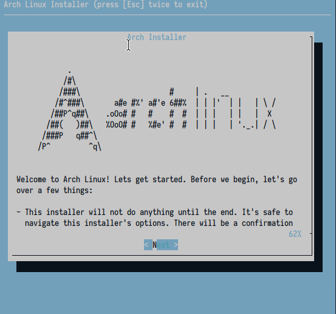

<p align='center'>
<br><br>
</p>

<h1 align='center'>
arch-installer
</h1>

<p align='center'>
Rico's automated Arch Linux installer
</p>

<p align='center'>

</p>

<br>

Boot into the Arch Linux Live USB, then type this for a graphical installer:

```sh
curl -s https://ricostacruz.com/arch-installer/install.sh | bash
```
