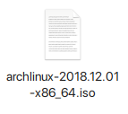
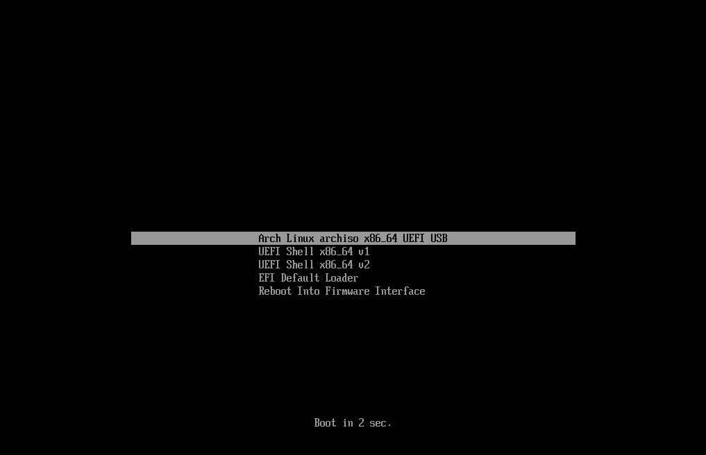
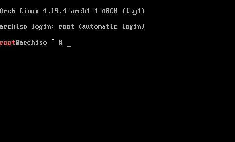

## Installing Arch Linux

Boot into the Arch Linux Live environment, and get it online. In the `root@archiso ~ #` prompt, type: _([view source](https://git.io/fhLAB))_

```sh
bash <(curl -sL https://git.io/fhLAB)
```

A detailed guide on doing this is below.

## Step-by-step instructions

| Image                                                                                                     | Step                                                                                                                                                                                      |
| --------------------------------------------------------------------------------------------------------- | ----------------------------------------------------------------------------------------------------------------------------------------------------------------------------------------- |
| <p align='center'></p>                                       | **Download Arch Linux** <br> [Download the Arch Linux live environment ISO][download] from the official Arch Linux website.                                                               |
| <a href='./images/ai-systemd-boot.gif'></a>           | **Boot to it** <br> [Put it into a USB drive][usb], and boot your system to it. (If you're installing into a VM, [here's a guide](./creating_virtualbox_vm.md) using VirtualBox.)         |
| <a href='./images/virtualbox-08-prompt.gif'></a> | **Wait for the prompt** <br> Boot to the installer. It takes a while, but eventually you'll be at the `root @ archiso ~ #` prompt.                                                        |
| <a href='./images/wifi-menu.gif'></a>                       | **Get online** <br> If you're not online yet, type `wifi-menu` to connect to wifi. (This may or may not work in your system. See [getting online](./getting_online.md) for alternatives.) |
| <a href='./images/ai-01-curl-bash.gif'></a>           | **Type the command** <br> Type the curl command and press _Enter_. This will start the installer.                                                                                         |

[download]: https://www.archlinux.org/download/
[usb]: https://wiki.archlinux.org/index.php/USB_flash_installation_media
