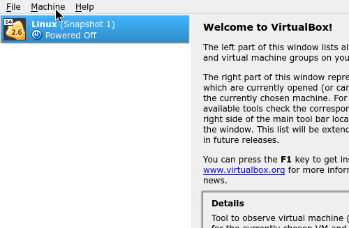
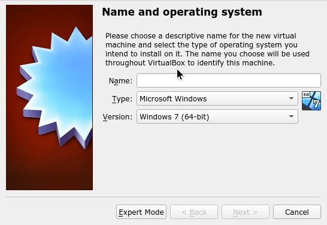
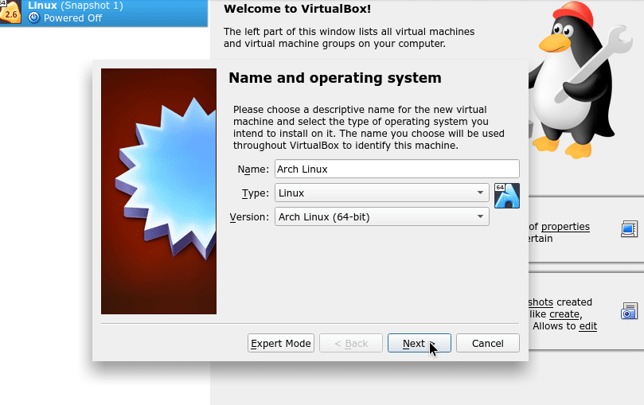
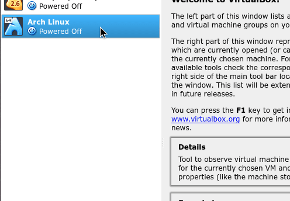
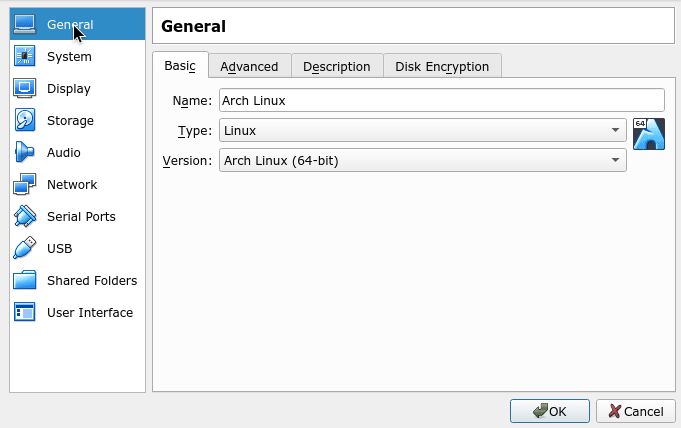
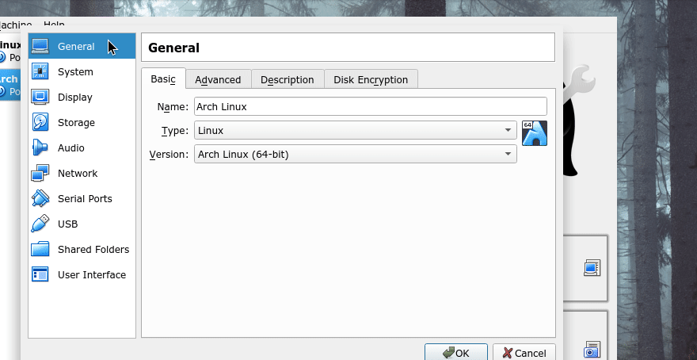
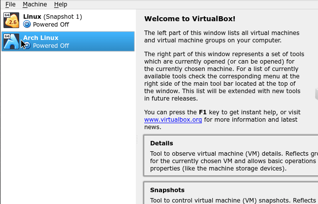

## Getting started in VirtualBox

The easiest way is to try it out is in VirtualBox.

| Image | Step |
| -- | -- |
|  | **Create a new machine**   In the menu bar, select `Machine` → `Add...`. |
|  | **Name your virtual machine**   Name your machine whatever you like (`Arch Linux` would be a good one to start with). Make sure the *Version* is `Arch Linux (64-bit)`. |
|  | **Create a disk**   The defaults are fine here, just keep pressing `Next` until the end of the wizard. |
|  | **Open the machine's settings**   Right-click on your machine and open `Settings`. |
|  | **Enable EFI**   Under `System`, enable the `Enable EFI` checkbox. |
|  | **Load the ArchLinux ISO**   Under `Storage`, select the optical drive (*"Empty"*). Under `Optical Drive:`, click the icon, and `Choose Virtual Optical Disk File`. Select the Arch Linux ISO. |
|  | **Start your VM!**   Right-click on your machine and start it (`Normal Start`). |
|  | **Wait for the prompt**   It will take a while, but eventually you'll be at the `root @ archiso ~ #` prompt. Start the installer! |
